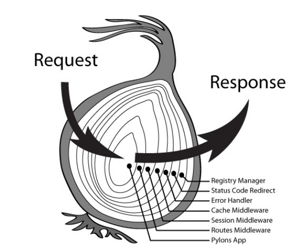
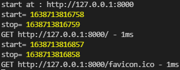

# 網站設計學習筆記(非原創結尾說明)

## Oak框架

Oak 是一款用來開發 http server 的中間件框架，其包含了 Router 路由中間件。 
Middleware 為框架主體的網頁應用程式開發框架，在 Middleware 架構下，你可以建置出多層的中介程序。

 
如圖，每個 Oak 的中間層都像是洋蔥的其中一圈，當後端程式收到 Http Request 會經過每層中間件的處理，最後變為 Response 傳送回去。

以簡單的範例介紹: 

`` import { Application } from "https://deno.land/x/oak/mod.ts";``

``const app = new Application();``

``app.use((ctx) => {``
`` ctx.response.body = "Hello World";``
``});``

``await app.listen({ port: 8000 }); ``

將 oak 的 Application 模組匯入之後，建立一個網頁應用程式實體 app 
並使用 app.use( ) 增加一層 Middleware 中介程序，上面程式碼範例的中介程序 
就是當伺服器收到 HTTP Request 時返回的 HTTP Response 內容是 Hello World字串 
最後一行是在啟動此應用程式時，會監聽指定的TCP埠當有人呼叫8000埠號時啟動此網頁應用程式 

----------------------------------------------------------------------------------------------------------

* Middle 中介程序

說明:

由 application 以可預測的順序在應用程序收到請求和發送響應之間執行的功能

中間件功能允許您將 server 的邏輯分解為封裝邏輯的功能，以及導入其他可以以非常鬆散耦合的方式為應用程序添加功能的中間件

要讓應用程序使用中間件功能，應用程序的實例具有 .use() 方法。中間件函數有兩個參數，一個上下文對象和一個 next() 函數。

因為中間件的處理本質上是異步的，所以中間件函數可以返回一個 promise 來指示它們何時完成處理

如果你使用 next()，幾乎所有的時間都會用到 await next()；以便中間件函數中的代碼按照預期執行
 

範例程式:
<pre>
import { Application } from "https://deno.land/x/oak/mod.ts";

const app = new Application();

// Logger
app.use(async (ctx, next) => {
  await next();
  const rt = ctx.response.headers.get("X-Response-Time");
  console.log(`${ctx.request.method} ${ctx.request.url} - ${rt}`);
});

// Timing
app.use(async (ctx, next) => { //必須加async 因為底下有await 有做輸出入
  const start = Date.now();
  console.log('start=', start)
  await next();//讓下一個middle執行
  const stop = Date.now();
  console.log('stop=', stop)
  const ms = stop - start;
  ctx.response.headers.set("X-Response-Time", `${ms}ms`);
});

// Hello World!
app.use((ctx) => {
  ctx.response.body = "Hello World!";
});

console.log('start at : http://127.0.0.1:8000')
await app.listen({ port: 8000 });
</pre>
執行結果 
 

上面範例程式增加了2個Middleware中介程序，Timeing 負責記錄完成 request 到 response 花了多少時間

ctx.response.headers.set("X-Response-Time", `${ms}ms`); 在表頭裡設定回應時間

在Logger裡將 request method & request.url & 花了多少時間 印出來

--------------------------------------------------------------------------------------------------------

* Router 

從 oak 模組中匯入 Router，就可以建立一個路由器實體 router，用來建立各種路由設定。

HTTP 設定方式相當直覺，方法名稱就是函數名稱，然後傳入路徑字串和該路由要怎麼處理 Http Context 的函數即可

若要讀取 Http Request 的 Body 內容時，所使用的 context.request.body() 方法是 Promise 物件，你必須要用 async await 或 Promise 的處理方式來操作。

<pre>
import { Application, Router } from "https://deno.land/x/oak/mod.ts";

const books = new Map();
books.set("1", {
  id: "1",
  title: "The Hound of the Baskervilles",
  author: "Conan Doyle, Arthur",
});
books.set("2", {
  id: "2",
  title: "The Old Man",
  author: "Lee Ear",
});
books.set("The Old Man", {
  id: "2",
  title: "The Old Man",
  author: "Lee Ear",
});
const router = new Router();
router
  .get("/", (context) => {
    context.response.body = "Hello world!";
  })
  .get("/book", (context) => {
    context.response.body = Array.from(books.values());
  })
  .get("/book/:id", (context) => {
    if (context.params && context.params.id && books.has(context.params.id)) {
      context.response.body = books.get(context.params.id);
    }
  })
  .get("/book/title/:title", (context) => {
    var title = context.params.title
    if (context.params && title && books.has(title)) {
      context.response.body = books.get(title);
    }
  })

const app = new Application();
app.use(router.routes());
app.use(router.allowedMethods());

console.log('start at : http://127.0.0.1:8000')
await app.listen({ port: 8000 });
</pre>

這個 router 範例程式用到 Map() 物件

內部為 [key, value] 的資料結構 

key 值的範圍不限於字串，可以是各種類型的值（包括 number、array、object、function、symbol...等等）

### Map 的操作方法

* set(key, value): 設置內容
* get(key): 獲取指定 key 的內容，若找不到返回undefined
* has(key): 檢查是否存在此 key，有則返回ture，無則返回false
* delete(key): 刪除指定 key 的內容，成功返回ture，失敗返回false

### Map 的迭代方法

* keys(): 取得所有 key
* values(): 取得所有成員的值
* entries(): 取得所有內容成員
* forEach(): 走訪 Map 的所有成員

------------------------------------------------------------------------------------------------

## sqlite

<pre>
import { DB } from "https://deno.land/x/sqlite/mod.ts";

// Open a database
const db = new DB("test.db");
db.query("CREATE TABLE IF NOT EXISTS people (id INTEGER PRIMARY KEY AUTOINCREMENT, name TEXT)"); //id欄位 name欄位型態是文字
//如果people表格不存在則創建一個新的 有兩個欄位 第一個欄位id 是一個自動增加的主鍵必須是唯一 ， 另一個欄位是name型態是文字
//而且是主鍵 必須是唯一 . id INTEGER PRIMARY KEY AUTOINCREMENT.說明id是一個整數並且自動增加

const names = ["Peter Parker", "Clark Kent", "Bruce Wayne"];

// Run a simple query
for (const name of names)
  db.query("INSERT INTO people (name) VALUES (?)", [name]); //新增紀錄
  //(?)對應到後面的[name]

// Print out data in table
for (const [id, name] of db.query("SELECT id, name FROM people"))//FROM people 從People表格裡  把id name挑出來
  console.log(id, name);

// Close connection
db.close();//關掉可以確保快取正確寫入比較安全
</pre>

首先匯入db模組

`` const db = new DB("test.db"); `` 

表示創建一個新的資料庫

`` db.query("CREATE TABLE IF NOT EXISTS people (id INTEGER PRIMARY KEY AUTOINCREMENT, name TEXT)"); `` 

創建一個新的 TABLE 如果 TABLE 不存在 people 為表格名稱， 表格內有兩個欄位一個是 id ，id 為一個整數並且是主鍵會自動增加，另一個是 name 型態為文字。

``const names = ["Peter Parker", "Clark Kent", "Bruce Wayne"];``

``for (const name of names)``

`` db.query("INSERT INTO people (name) VALUES (?)", [name]); ``

新增一筆紀錄到資料庫 (?) 對應到[name]

``for (const [id, name] of db.query("SELECT id, name FROM people"))``

FROM people 從People表格裡  把id name挑出來
 
``console.log(id, name);``

將 id , name 欄位顯示出來

``db.close()``

關掉可以確保快取正確寫入比較安全

* 圖片來源:

https://ianchen0119.gitbook.io/deno/shi-yong-deno-da-zao-web-api/oak-kuang-jia-jie-shao

* 參考資料

老師上課的範例程式

https://ianchen0119.gitbook.io/deno/shi-yong-deno-da-zao-web-api/oak-kuang-jia-jie-shao

https://github.com/oakserver/oak

https://blog.poychang.net/build-deno-web-app-with-oak/
