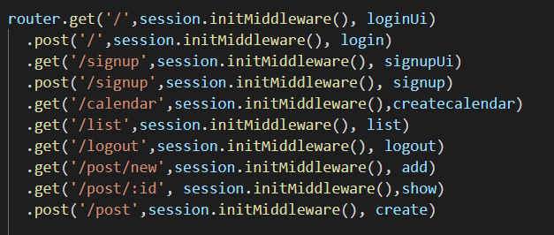
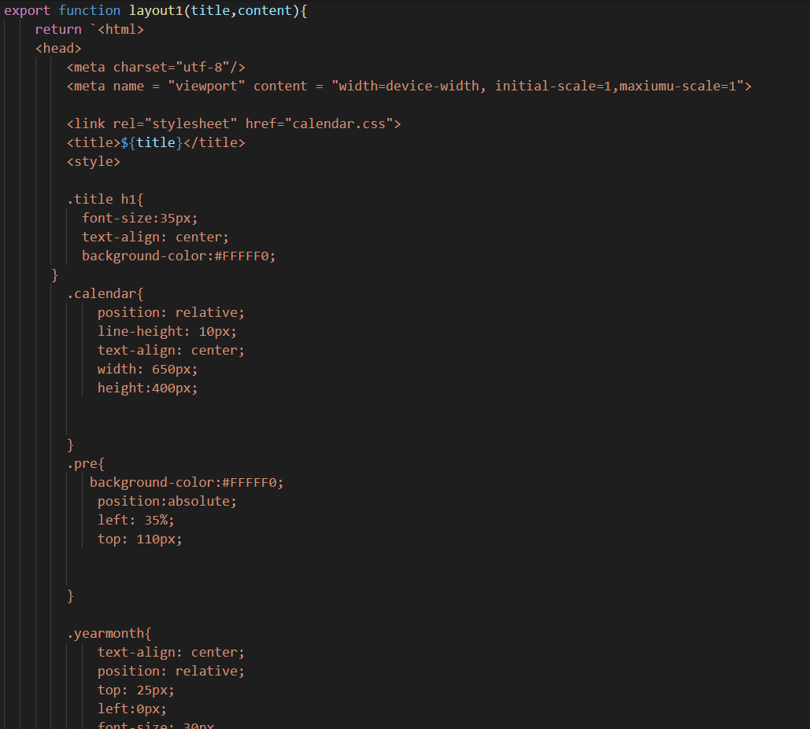
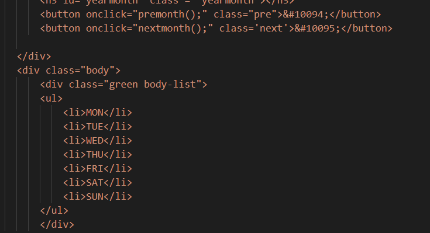
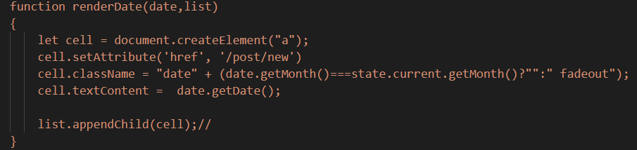

# 行事曆網站 (非原創)
<pre>
網站入口 : http://172.104.100.202:8110/

(埠號設定規則我是用8加上我的學號末三碼)

雖然使用網路上教學影片和老師的code，但已花時間完全理解

使用老師上課的<a href = "https://gitlab.com/ccckmit/ws/-/tree/master/07-session/03-blogSignup">教學範例</a> 為主要網站架構

我主要調整了Router以及調整css

</img>

</img>

並且新增了行事曆畫面 參考自<a href = "https://www.youtube.com/watch?v=Q2x84RdNVUY&t=3159s&
ab_channel=%E5%BD%AD%E5%BD%AD%E7%9A%84%E8%AA%B2%E7%A8%8B">網路教學影片</a>

並自己新增了兩個按鈕並顯示對應的日期是星期幾

</img>

以及為日期畫面新增上可以點選一個日期並創建貼文的功能

</img>

</pre>

產生行事曆畫面用到以下

* Date物件

當前時間:new Date()

指定時間:new Date(year,month,day,hours,muites,seconds,milliseconds)

* 方法

* 取得星期幾 : getDay()

* 取得日期 : getDate()

* 取得月份 : getMonth()

* 取得年分 : getFullYear()

* 設定日期 : setDate(date)

* 設定月份 setMonth(month)

----------------------------------------------------------------------------------------

## linode

用老師的 linode 帳號架站 

首先需要創建一個自己的資料夾我的資料夾名稱為 ian

接下來 clone gitlab 上的 code 到資料夾裡頭這邊使用https就可以了

接著在 app.js 的資料夾內新增一個 run.sh 檔案

$ vim run.sh 會進入這個資料夾要是沒有會自動創建 接著進到~~~波浪狀視窗先按L搭配其他鍵一起按

接著編輯打deno run -A app.js

再按下esc退出要儲存按下 shift + ; 

並輸入 wq 儲存並離開  接著輸入ls會看到run.sh已經創建 

接著 $ chmod +x 伺服器名稱 

再來用 pm2 啟動 run.sh  使用 $ pm2 start 伺服器名稱

伺服器成功啟動啟動